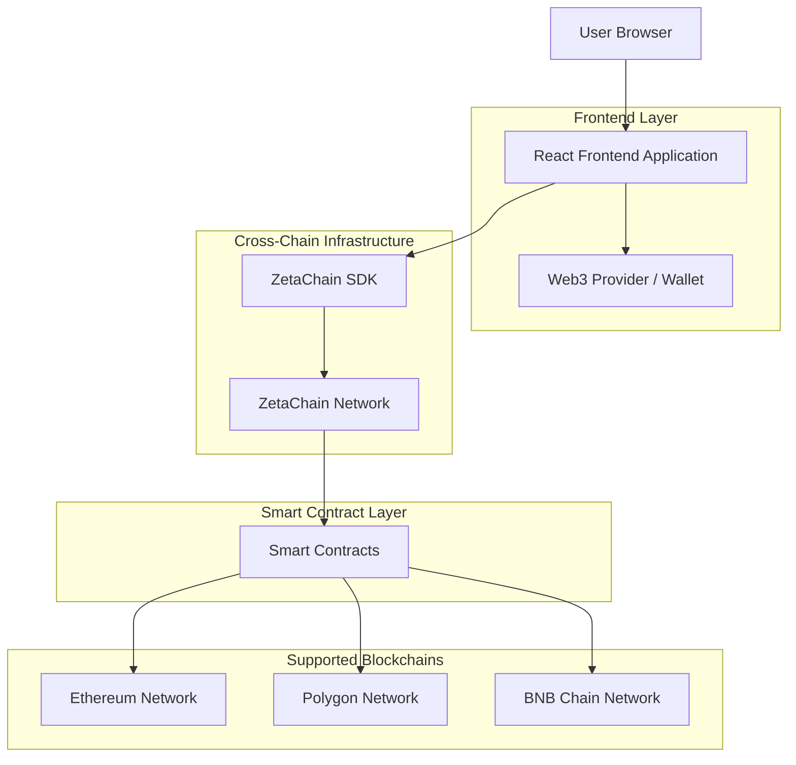
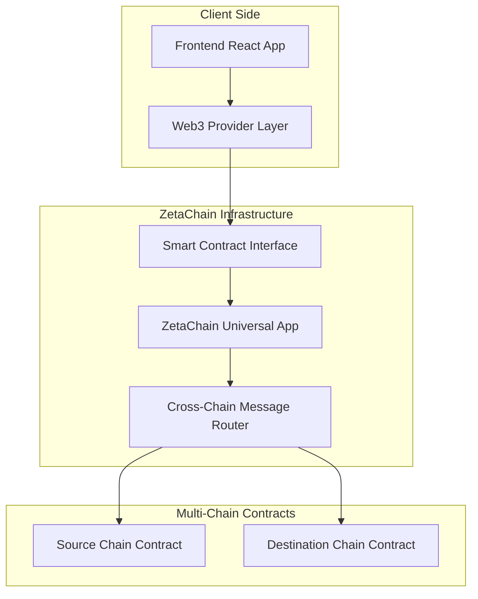
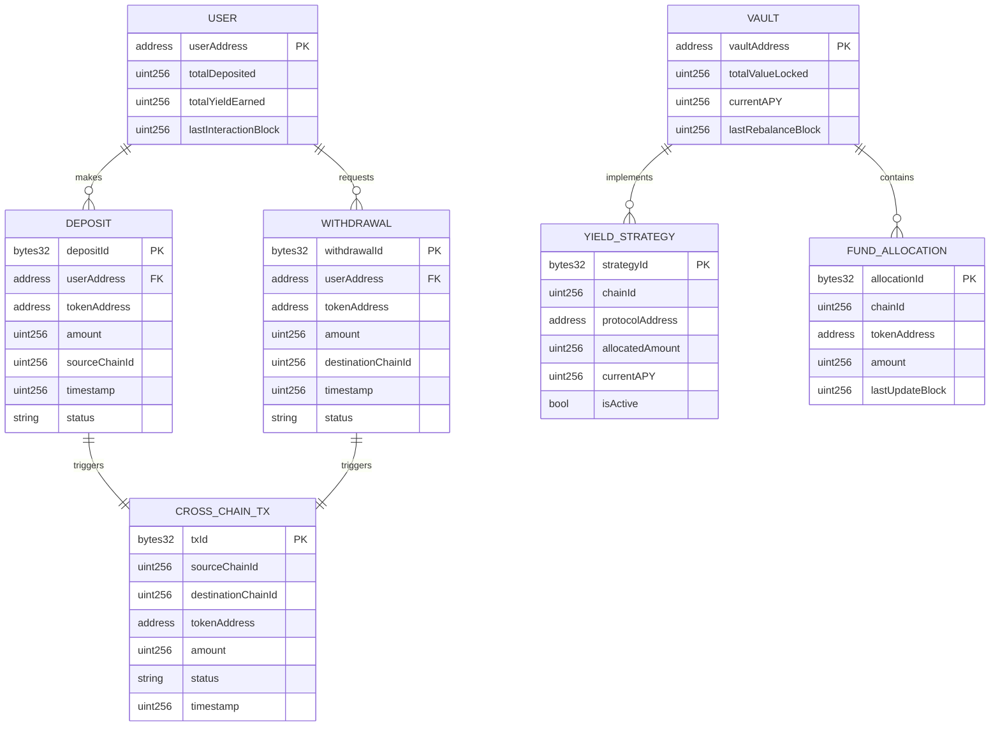

# Cross-Chain DeFi Vault - Technical Architecture Document

## 1. Architecture Design



## 2. Technology Description

- Frontend: React@18 + TypeScript + TailwindCSS@3 + Vite + Ethers.js@6
- Cross-Chain: ZetaChain SDK + ZetaChain Contracts
- Smart Contracts: Solidity + Hardhat + OpenZeppelin
- Web3 Integration: Ethers.js + WalletConnect + MetaMask

## 3. Route Definitions

| Route | Purpose |
|-------|----------|
| / | Dashboard page, displays portfolio overview and quick actions |
| /deposit | Deposit page, allows users to deposit tokens from any supported chain |
| /withdraw | Withdraw page, enables cross-chain withdrawals to any supported chain |
| /history | Transaction history page, shows all deposits, withdrawals, and yields |
| /vault | Vault status page, displays fund allocation and yield strategies |
| /connect | Wallet connection page, handles Web3 wallet integration |

## 4. API Definitions

### 4.1 Smart Contract Interfaces

**Vault Contract (ZetaChain)**
```solidity
function deposit(address token, uint256 amount, uint256 sourceChainId) external
function withdraw(address token, uint256 amount, uint256 destinationChainId) external
function getUserBalance(address user, address token) external view returns (uint256)
function getTotalVaultValue() external view returns (uint256)
```

**Cross-Chain Message Handling**
```solidity
function onCall(
    MessageContext calldata context,
    address zrc20,
    uint256 amount,
    bytes calldata message
) external override

function onRevert(
    RevertContext calldata revertContext
) external override

function onAbort(
    AbortContext calldata abortContext  
) external override
```

### 4.2 Frontend API Calls

**Deposit Transaction**
```typescript
interface DepositRequest {
  tokenAddress: string;
  amount: string;
  sourceChainId: number;
  userAddress: string;
}

interface DepositResponse {
  transactionHash: string;
  status: 'pending' | 'confirmed' | 'failed';
  crossChainTxId?: string;
}
```

**Withdraw Transaction**
```typescript
interface WithdrawRequest {
  tokenAddress: string;
  amount: string;
  destinationChainId: number;
  userAddress: string;
}

interface WithdrawResponse {
  transactionHash: string;
  status: 'pending' | 'confirmed' | 'failed';
  estimatedArrival: number;
}
```

**User Balance Query**
```typescript
interface BalanceRequest {
  userAddress: string;
  tokenAddress?: string;
}

interface BalanceResponse {
  totalBalance: string;
  balanceByChain: {
    chainId: number;
    balance: string;
    yieldEarned: string;
  }[];
}
```

## 5. Server Architecture Diagram



## 6. Data Model

### 6.1 Data Model Definition



### 6.2 Data Definition Language

**User Balance Mapping (Smart Contract Storage)**
```solidity
// User balance tracking
mapping(address => mapping(address => uint256)) public userBalances;
mapping(address => uint256) public userTotalDeposits;
mapping(address => uint256) public userYieldEarned;

// Vault state tracking
mapping(uint256 => uint256) public chainAllocations;
mapping(address => bool) public supportedTokens;
mapping(uint256 => bool) public supportedChains;

// Cross-chain transaction tracking
mapping(bytes32 => CrossChainTx) public crossChainTransactions;

struct CrossChainTx {
    address user;
    address token;
    uint256 amount;
    uint256 sourceChain;
    uint256 destinationChain;
    uint256 timestamp;
    TxStatus status;
}

enum TxStatus {
    Pending,
    InProgress,
    Completed,
    Failed,
    Reverted
}
```

**Vault Configuration**
```solidity
// Initialize supported tokens
supportedTokens[0xA0b86a33E6441c8C06DD2b7c94b7E0e8c0c8c8c8] = true; // USDC
supportedTokens[0xdAC17F958D2ee523a2206206994597C13D831ec7] = true; // USDT
supportedTokens[0xC02aaA39b223FE8D0A0e5C4F27eAD9083C756Cc2] = true; // WETH

// Initialize supported chains
supportedChains[1] = true;     // Ethereum
supportedChains[137] = true;   // Polygon
supportedChains[56] = true;    // BNB Chain
supportedChains[7000] = true;  // ZetaChain

// Set initial yield strategy (simplified)
chainAllocations[137] = 70; // 70% to Polygon for higher yields
chainAllocations[56] = 30;  // 30% to BNB Chain
```

**Events for Frontend Integration**
```solidity
event DepositInitiated(
    address indexed user,
    address indexed token,
    uint256 amount,
    uint256 sourceChain,
    bytes32 indexed txId
);

event WithdrawalRequested(
    address indexed user,
    address indexed token,
    uint256 amount,
    uint256 destinationChain,
    bytes32 indexed txId
);

event CrossChainTransferCompleted(
    bytes32 indexed txId,
    uint256 sourceChain,
    uint256 destinationChain,
    uint256 amount
);

event YieldDistributed(
    address indexed user,
    address indexed token,
    uint256 yieldAmount
);
```