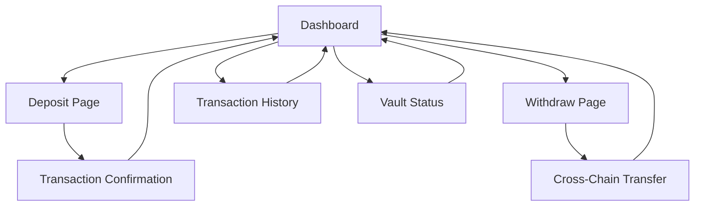

# Cross-Chain DeFi Vault - Product Requirements Document

## 1. Product Overview
A Cross-Chain DeFi Vault that functions as a "super savings account" allowing users to deposit tokens on any supported blockchain and automatically invest across multiple chains for optimal yield generation.

The vault solves the problem of fragmented DeFi yields across different blockchains by providing a unified interface for cross-chain yield farming. Target users include DeFi investors, yield farmers, and crypto holders seeking passive income without manual chain management.

Target market value: Simplify cross-chain DeFi interactions and maximize yield opportunities for retail and institutional investors.

## 2. Core Features

### 2.1 User Roles
| Role | Registration Method | Core Permissions |
|------|---------------------|------------------|
| Vault User | Wallet connection (MetaMask, WalletConnect) | Can deposit, withdraw, view balances and yields |
| Vault Admin | Contract deployment/ownership | Can update yield strategies, manage supported chains |

### 2.2 Feature Module
Our Cross-Chain DeFi Vault consists of the following main pages:
1. **Dashboard**: Portfolio overview, total balance, yield summary, supported chains display
2. **Deposit Page**: Chain selection, token selection, amount input, transaction confirmation
3. **Withdraw Page**: Destination chain selection, withdrawal amount, cross-chain transfer status
4. **Transaction History**: Deposit/withdrawal records, cross-chain transfer tracking, yield earnings
5. **Vault Status**: Current fund allocation across chains, active yield strategies, performance metrics

### 2.3 Page Details
| Page Name | Module Name | Feature description |
|-----------|-------------|---------------------|
| Dashboard | Portfolio Overview | Display total vault balance, current yield rate, earnings summary |
| Dashboard | Supported Chains | Show available chains (Ethereum, Polygon, BNB Chain) with status indicators |
| Dashboard | Quick Actions | Fast access buttons for deposit and withdraw functions |
| Deposit Page | Chain Selector | Dropdown to choose source blockchain for deposit |
| Deposit Page | Token Selector | Select supported tokens (USDC, USDT, ETH) with balance display |
| Deposit Page | Amount Input | Enter deposit amount with max balance button and USD conversion |
| Deposit Page | Transaction Preview | Show estimated gas fees, cross-chain transfer details, confirmation |
| Withdraw Page | Destination Chain | Select target blockchain for withdrawal |
| Withdraw Page | Amount Input | Enter withdrawal amount with available balance display |
| Withdraw Page | Cross-Chain Status | Real-time tracking of cross-chain transfer progress |
| Transaction History | Transaction List | Paginated list of all deposits, withdrawals, and yield distributions |
| Transaction History | Filter Options | Filter by transaction type, date range, and blockchain |
| Vault Status | Fund Allocation | Visual chart showing fund distribution across different chains |
| Vault Status | Yield Strategies | Display active yield farming strategies and their performance |
| Vault Status | Performance Metrics | APY tracking, historical yield data, risk metrics |

## 3. Core Process

**Main User Flow:**
1. User connects wallet and views dashboard showing current portfolio
2. User navigates to deposit page, selects source chain (e.g., Ethereum) and token (e.g., USDC)
3. User enters deposit amount and confirms transaction
4. Vault automatically transfers funds to optimal yield chain (e.g., Polygon) via ZetaChain
5. User can monitor fund allocation and yield generation on vault status page
6. For withdrawal, user selects destination chain and amount on withdraw page
7. Vault processes cross-chain withdrawal and delivers funds to chosen chain
8. All transactions are recorded in transaction history with cross-chain tracking

## 4. User Interface Design

### 4.1 Design Style
- Primary colors: Deep blue (#1E3A8A) and bright green (#10B981) for DeFi branding
- Secondary colors: Light gray (#F3F4F6) backgrounds, dark gray (#374151) text
- Button style: Rounded corners (8px radius) with gradient effects and hover animations
- Font: Inter or Roboto, 14px base size, 16px for headings, 12px for secondary text
- Layout style: Card-based design with clean spacing, top navigation with wallet connection
- Icons: Cryptocurrency and blockchain icons, arrow indicators for cross-chain transfers

### 4.2 Page Design Overview
| Page Name | Module Name | UI Elements |
|-----------|-------------|-------------|
| Dashboard | Portfolio Overview | Large balance card with gradient background, green/red yield indicators, animated counters |
| Dashboard | Supported Chains | Chain logos in circular badges, status dots (green/yellow/red), hover effects |
| Dashboard | Quick Actions | Prominent CTA buttons with icons, blue primary and green secondary colors |
| Deposit Page | Chain Selector | Dropdown with chain logos, network names, and gas fee estimates |
| Deposit Page | Token Selector | Token list with logos, symbols, current balances, and USD values |
| Deposit Page | Amount Input | Large input field with max button, real-time USD conversion, balance validation |
| Withdraw Page | Destination Chain | Visual chain selector with estimated transfer times and fees |
| Withdraw Page | Cross-Chain Status | Progress bar with step indicators, transaction hash links, estimated completion |
| Transaction History | Transaction List | Table with status badges, chain icons, amount formatting, and expandable details |
| Vault Status | Fund Allocation | Donut chart with chain colors, percentage labels, and interactive tooltips |
| Vault Status | Performance Metrics | Line charts for APY trends, metric cards with percentage changes |

### 4.3 Responsiveness
Desktop-first design with mobile-adaptive breakpoints at 768px and 1024px. Touch-optimized buttons and inputs for mobile devices, with simplified navigation and stacked card layouts on smaller screens.